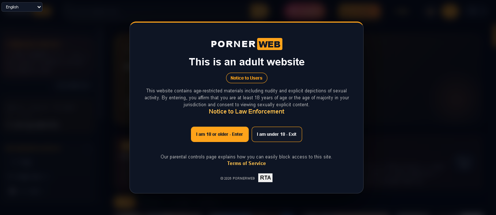
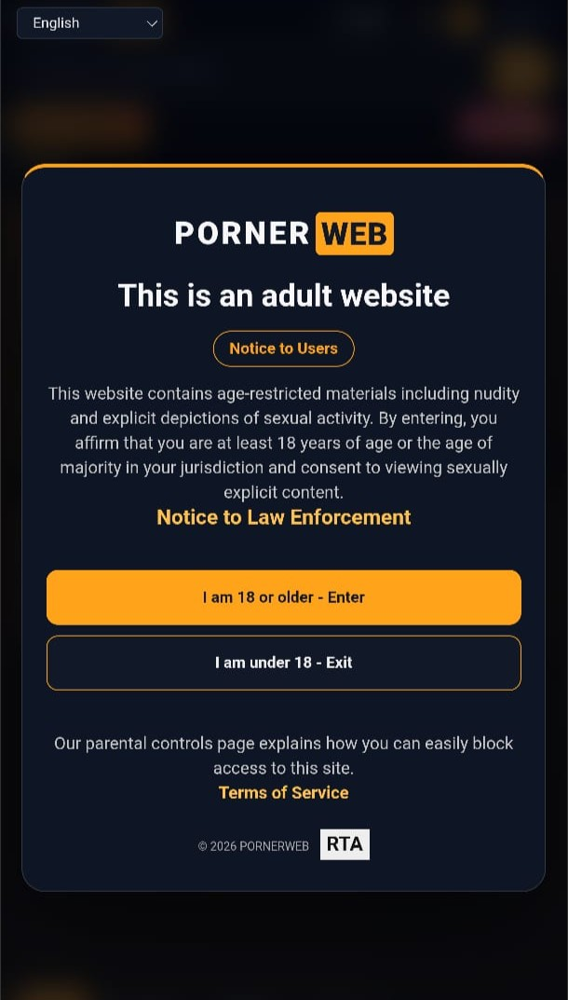

<div align="center">

# PORNERWEB

### Platform Agregator Video Dewasa Berbasis Node.js dan Express

<p>
  <strong>PornerWeb</strong> adalah aplikasi web server-side rendered yang mengagregasi data video dari sumber eksternal, lalu menyajikannya melalui antarmuka yang responsif, ringan, dan mudah dinavigasi.
</p>

<a href="https://pornerweb.pro">
    
  </a>

## Preview Dekstop



## Preview Mobile



<p>
  <a href="https://pornerweb.pro">
    
  </a>
  <a href="https://github.com/rizalfirmansyah120593-byte/pornerweb">
    
  </a>
  <a href="https://github.com/rizalfirmansyah120593-byte/pornerweb/issues">
    
  </a>
  <a href="https://saweria.co/RizalFirmansyah">
    
  </a>
</p>

<p>
  
  
  
  
  
</p>

<p><em>Khusus pengunjung berusia 18 tahun ke atas.</em></p>

</div>

---

## Tentang PornerWeb

PornerWeb merupakan proyek web agregator konten yang dibangun dengan **Node.js**, **Express**, **EJS**, dan CSS responsif. Aplikasi mengambil data dari sumber eksternal menggunakan library scraper, mengolahnya di sisi server, kemudian menghasilkan halaman yang terstruktur untuk pengguna dan mesin pencari.

Fokus utama proyek ini adalah pengalaman browsing yang sederhana, performa server-side rendering, navigasi berbasis kategori, serta fondasi SEO teknis seperti canonical URL, sitemap, robots.txt, Open Graph, dan JSON-LD.

> **Catatan penggunaan:** proyek ini hanya mengagregasi metadata dari sumber eksternal. Pastikan penggunaan aplikasi, konten, dan deployment mematuhi hukum, kebijakan hosting, hak cipta, serta ketentuan layanan yang berlaku di wilayah Anda.

### Akses Website dan Demo

Link website atau demo mungkin tidak dapat dibuka dari sebagian negara atau jaringan karena pembatasan lokal, kebijakan ISP, firewall, atau pemblokiran dari sumber video eksternal. Jika akses VPN diizinkan secara hukum di wilayah Anda, gunakan VPN dengan lokasi server yang dapat mengakses website atau demo tersebut, lalu buka kembali link menggunakan HTTPS.

VPN tidak menjamin video dari semua sumber dapat diputar dan tidak menghapus kewajiban untuk mematuhi hukum, batas usia, kebijakan jaringan, serta ketentuan layanan yang berlaku. Aplikasi ini ditujukan hanya untuk pengguna berusia 18 tahun ke atas.

## Fitur Utama

| Fitur | Deskripsi |
| --- | --- |
| Agregasi data dinamis | Mengambil dan menampilkan data video dari sumber eksternal secara terstruktur. |
| Server-side rendering | Halaman dirender dengan EJS untuk akses awal yang cepat dan crawlability yang baik. |
| Pencarian dan kategori | Mendukung pencarian, kategori, model, rekomendasi, serta filter negara. |
| Detail video | Halaman tontonan dengan metadata, tag, durasi, views, embed, dan rekomendasi. |
| Pagination | Navigasi halaman untuk koleksi dengan jumlah data besar. |
| Responsive UI | Tampilan menyesuaikan desktop, tablet, dan mobile. |
| Multi-bahasa | Preferensi bahasa Indonesia dan Inggris dengan cookie ringan. |
| Tema antarmuka | Pilihan tema terang, gelap, dan otomatis mengikuti sistem. |
| SEO teknis | Canonical URL, meta description, Open Graph, Twitter Card, sitemap, robots.txt, dan JSON-LD. |
| Tanpa database | Tidak membutuhkan MongoDB, MySQL, atau fitur login untuk berjalan. |
| Error handling | Error sumber eksternal ditangani dengan halaman fallback yang informatif. |

## Teknologi yang Digunakan

- **Runtime:** Node.js, ES Modules
- **Backend:** Express.js
- **Template engine:** EJS
- **Scraping/API client:** Pornhub.js lokal dan dependency runtime terkait
- **Frontend:** HTML semantik, CSS responsif, vanilla JavaScript
- **SEO:** meta tags dinamis, canonical URL, Open Graph, JSON-LD, sitemap XML
- **Deployment:** Hostinger Node.js, GitHub

## Struktur Proyek

```text
.
├── config/
│   └── seo.js              # Konfigurasi SEO, URL, kategori, negara, dan JSON-LD
├── public/
│   ├── css/site.css        # Style responsif dan tema UI
│   ├── images/             # Asset gambar publik
│   └── favicon.svg
├── views/
│   ├── partials/           # Header, footer, sidebar, dan SEO head
│   ├── index.ejs           # Halaman listing
│   ├── watch.ejs           # Halaman detail video
│   └── error.ejs           # Halaman error/fallback
├── Pornhub.js-master/
│   └── dist/               # Bundle library yang dibutuhkan saat runtime
├── server.js               # Aplikasi Express utama
├── index.js                # Fallback startup file untuk hosting
├── package.json
└── package-lock.json
```

## Menjalankan Secara Lokal

### Prasyarat

- Node.js 18 atau lebih baru
- npm
- Koneksi internet untuk mengambil data eksternal

### Instalasi

```bash
git clone https://github.com/rizalfirmansyah120593-byte/pornerweb.git
cd pornerweb
npm install
npm start
```

Buka `http://localhost:3000` di browser. Port mengikuti environment variable `PORT` jika tersedia.

### Pemeriksaan kode

```bash
npm run check
```

## Konfigurasi Environment

Buat file `.env` secara lokal atau masukkan variable melalui dashboard Hostinger:

```env
NODE_ENV=production
SITE_URL=https://domain-anda.com
SITE_NAME=PORNERWEB
SITE_DESCRIPTION=Deskripsi singkat dan relevan tentang situs Anda.
GOOGLE_SITE_VERIFICATION=token-dari-google-search-console
SITEMAP_LASTMOD=2026-08-03
```

`MONGODB_URI` dan `SESSION_SECRET` tidak diperlukan karena aplikasi tidak menggunakan database atau autentikasi pengguna.
`SITEMAP_LASTMOD` bersifat opsional; ubah hanya ketika halaman publik memang diperbarui.

> Jangan commit file `.env`. File tersebut sudah tercantum di `.gitignore`.

## Deployment ke Hostinger

PornerWeb berjalan sebagai aplikasi Node.js server-side, bukan sebagai static hosting biasa.

1. Push source code terbaru ke GitHub.
2. Buat atau buka aplikasi **Node.js** di Hostinger.
3. Hubungkan repository GitHub ini.
4. Gunakan startup file `index.js` atau `server.js`.
5. Jalankan instalasi dependency dengan `npm install`.
6. Gunakan start command `npm start` jika diminta.
7. Tambahkan environment variable produksi pada bagian konfigurasi aplikasi.
8. Pastikan folder `Pornhub.js-master/dist/` ikut masuk ke repository.
9. Deploy atau restart aplikasi.

### Troubleshooting deployment

#### Error `503 Service Unavailable`

- Pastikan aplikasi dibuat sebagai **Node.js Web App**, bukan static website.
- Pastikan startup file adalah `index.js` atau `server.js`.
- Pastikan `npm install` berhasil.
- Pastikan environment variable `PORT` tidak di-hardcode; Hostinger menyediakan port aplikasi.
- Buka runtime log Hostinger untuk melihat error proses Node.js.

#### Error `ERR_MODULE_NOT_FOUND: Cannot find package 'urlcat'`

Jalankan kembali instalasi dependency dan deploy file berikut:

```bash
npm install
git add package.json package-lock.json Pornhub.js-master/dist
git commit -m "Fix production runtime dependencies"
git push
```

Dependency `urlcat`, `cheerio`, `debug`, dan `node-fetch` sudah tercantum di `package.json` utama agar ikut terpasang di Hostinger.

## SEO Checklist Produksi

Gunakan checklist berikut setelah domain aktif:

- Gunakan `SITE_URL` dengan domain HTTPS yang benar.
- Pastikan halaman utama memiliki title dan description yang unik.
- Uji `https://domain-anda.com/robots.txt`.
- Uji `https://domain-anda.com/sitemap.xml`.
- Daftarkan sitemap di Google Search Console.
- Gunakan URL Inspection untuk halaman utama dan halaman kategori.
- Pastikan canonical URL tidak mengarah ke domain staging.
- Gunakan gambar preview yang dapat diakses publik.
- Periksa tampilan Open Graph saat URL dibagikan ke media sosial.
- Jangan mengindeks halaman error, parameter pencarian, atau halaman yang tidak memiliki konten bermanfaat.

Endpoint SEO yang tersedia:

| Endpoint | Kegunaan |
| --- | --- |
| `/robots.txt` | Instruksi crawler mesin pencari |
| `/sitemap.xml` | Daftar URL publik yang dapat di-crawl |
| `/` | Halaman utama dan koleksi populer |
| `/category/:slug` | Landing page kategori |
| `/country/:slug` | Landing page berdasarkan negara |
| `/watch/:id` | Halaman detail video |

## Kontribusi

Pull request dan issue dipersilakan. Sebelum mengirim perubahan:

```bash
npm install
npm run check
```

Pastikan perubahan tidak memasukkan credential, token, cookie, atau file `.env` ke repository.

## Dukung Pengembangan

Jika PornerWeb membantu Anda atau Anda menikmati hasil pengembangannya, dukungan melalui Saweria sangat berarti. Donasi yang terkumpul membantu membiayai domain, server, bandwidth, pemeliharaan keamanan, perbaikan bug, dan pengembangan fitur baru agar proyek ini tetap aktif serta nyaman digunakan.

Tidak ada kewajiban untuk berdonasi—dukungan sekecil apa pun tetap membantu dan sangat dihargai. Jika ingin ikut menjaga proyek ini tetap berjalan, Anda dapat memberikan dukungan melalui tombol berikut:

<div align="center">

<a href="https://saweria.co/RizalFirmansyah">
  
</a>

<p><em>Dukungan Anda membantu PornerWeb terus dirawat, ditingkatkan, dan tersedia secara online.</em></p>

</div>

## Lisensi dan Tanggung Jawab

Tambahkan file `LICENSE` sesuai lisensi yang ingin digunakan pemilik repository. Dependency pihak ketiga tetap mengikuti lisensi masing-masing. Pengelola deployment bertanggung jawab memastikan penggunaan aplikasi mematuhi hukum dan kebijakan layanan yang berlaku.

<div align="center">

<br>

<a href="https://pornerweb.pro">
  
</a>
<a href="https://github.com/rizalfirmansyah120593-byte/pornerweb/issues/new">
  
</a>
<a href="https://saweria.co/RizalFirmansyah">
  
</a>

<p>Made with Node.js, Express, EJS, and ❤️</p>

</div>
